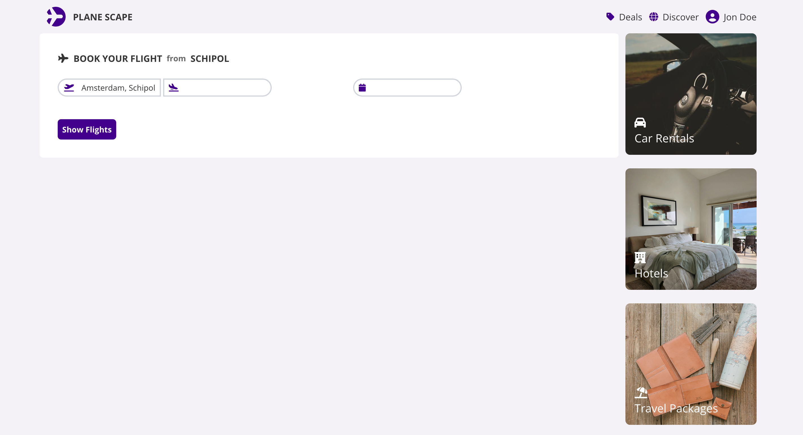

# Plane Scape

**Plane Scape** is a web application that allows users to select a destination and time to view departure flights from Schiphol Airport on that day. Users can book flights, which are then saved to a MongoDB database.

## Features

- **Select Destination**: Users can choose their desired destination from a list of available flights.
- **Choose Time**: Users can select the desired departure date and time.
- **View Flights**: Lists all available departure flights for the selected date.
- **Book Flights**: Users can book a flight, which gets saved to a MongoDB database.

## Screenshots

  
_Home Page: Select your destination and departure time._

  
_Flight Listing: View available flights based on your selection._

  
_List Booked Flights: View Booked flights._

  
_Filter Booked Flights_

## Getting Started

To get a local copy up and running, follow these steps:

### Prerequisites

- [Node.js](https://nodejs.org/) (version 14 or later)
- [MongoDB](https://www.mongodb.com/) account (for database)

### Installation

1. Clone the repository:

   ```bash
   git clone https://github.com/yourusername/plane-scape.git
   ```

2. Navigate to the project directory:

   ```bash
   cd plane-scape
   ```

3. Install the depencencies:
   ```bash
   npm install
   ```
4. Create a .env.local file in the root of you project and add the following fields:
   ```bash
   SCHIPHOL_APP_ID=your_schiphol_app_id
   SCHIPHOL_APP_KEY=your_schiphol_app_key
   MONGO_URI=your_mongodb_connection_string
   ```

## Usage

- Select your destination and departure date.
- Click on Show Flights to view available flights.
- Choose a flight and click on Book Flight to save it to the database
- Click on profile icon to see booked flights.
